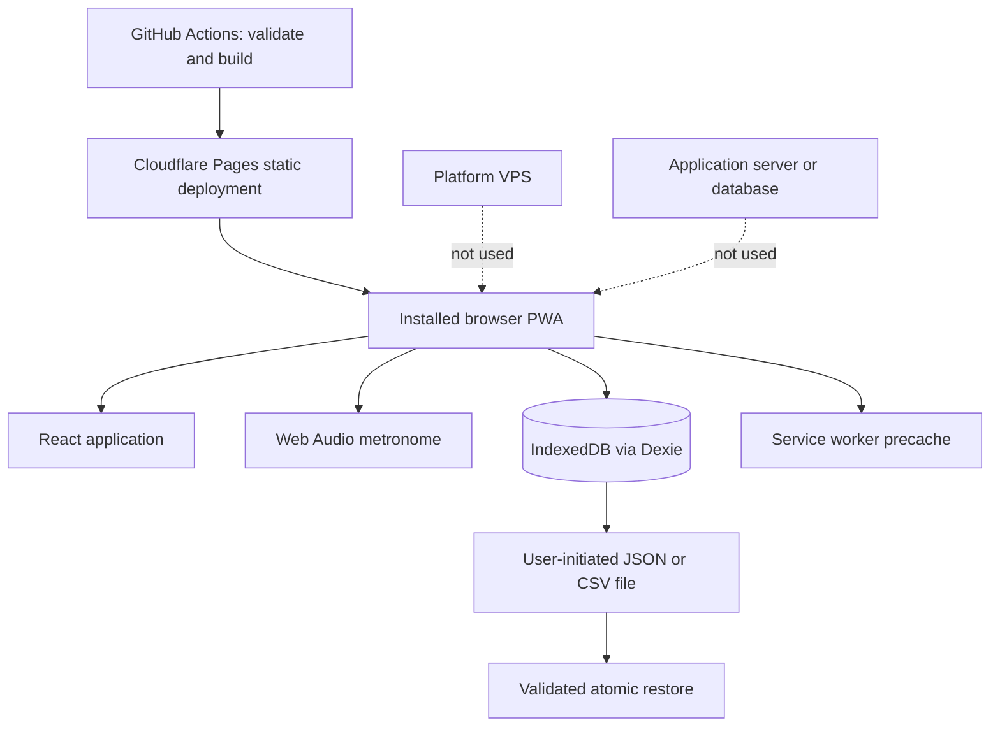
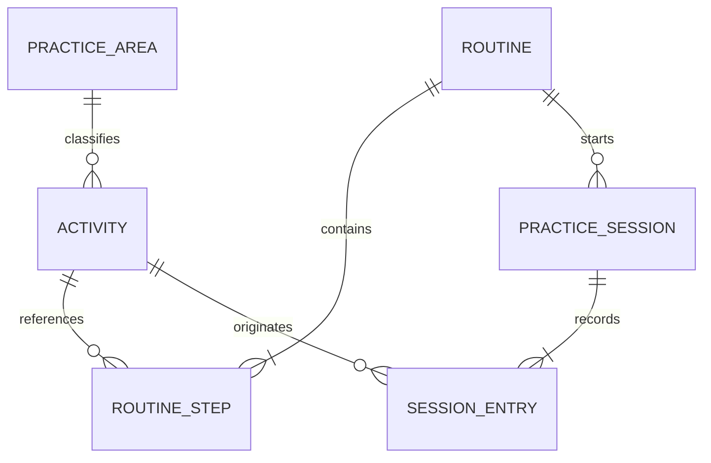
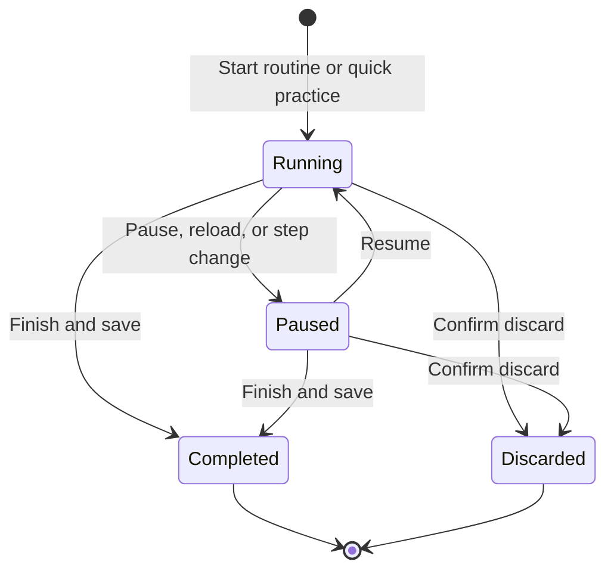

# Architecture: Practice Companion

| Field          | Value                            |
| -------------- | -------------------------------- |
| Document       | `BW-PRACTICE-ARCH-001`           |
| Version        | 1.1                              |
| Status         | Accepted                         |
| Service ID     | `practice`                       |
| Repository     | `bwinkeler-music-practice`       |
| Planned origin | `https://practice.bwinkeler.com` |

## 1. Scope

Practice Companion is a single-user, local-first Progressive Web App for
planning, running, and reviewing piano and keyboard practice. This document
describes how the application is built. The product concept and its rationale
live in `PRACTICE-COMPANION-PROPOSAL.md` in this directory.

## 2. Runtime topology

Cloudflare serves static files. No practice record ever reaches the platform,
so there is no server-side state, secret, migration, or backup job.

## 3. Module boundaries

| Layer             | Location                                                             | Rule                                                                                |
| ----------------- | -------------------------------------------------------------------- | ----------------------------------------------------------------------------------- |
| Domain logic      | `src/session/`, `src/audio/scheduler.ts`, `src/stats/`, `src/music/` | Pure TypeScript, no React, no DOM, fully unit-tested                                |
| Persistence       | `src/data/`                                                          | Dexie schema, repository operations, backup and CSV serialisation, input validation |
| Platform adapters | `src/audio/metronome.ts`, `src/pwa.ts`, `src/app/appearance.ts`      | The only modules allowed to touch Web Audio, the service worker, or `localStorage`  |
| Application state | `src/app/store.tsx`                                                  | One provider owning the loaded snapshot and every mutation                          |
| Interface         | `src/features/`, `src/components/`                                   | Presentation and interaction only; no direct database access                        |

Dependencies point downward: features use the store, the store uses the
repository, the repository uses Dexie. Nothing in `src/data` imports React.

## 4. Data model

Records are defined in `src/data/types.ts` and stored in five Dexie tables:
`areas`, `activities`, `routines`, `sessions`, `settings`.

Invariants:

- **Ordering is explicit.** Routine steps are an ordered array embedded in the
  routine document, so a reorder is one atomic write and the order can never
  disagree with itself.
- **History is a snapshot.** A session entry stores the activity title, the
  practice area key, and the area name as they were at the time. Renaming,
  archiving, or deleting an activity never rewrites the past.
- **Durations are integers.** `SessionEntry.activeMs` holds whole milliseconds;
  a session's duration is the sum of its entries, never a formatted string.
- **Instants are ISO 8601.** Aggregation converts them to local civil days at
  calculation time, so daylight-saving changes cannot move a session.
- **Built-in labels are keys.** Built-in practice areas store `builtInKey` and
  are translated at render time; user-created areas store the typed name.

`databaseSchemaVersion` in `src/data/db.ts` and `backupSchemaVersion` in
`src/data/backup.ts` are independent. Bumping either requires a migration step
and a fixture.

## 5. Session timing

Elapsed time is derived from wall-clock timestamps, never from counting timer
ticks (`src/session/timing.ts`):

- the running entry accumulates from `runningSince`;
- pause, resume, and step changes flush the accumulated interval first;
- a negative interval (clock or timezone moved backwards) is clamped to zero;
- a 10-second heartbeat persists the accumulated time while running;
- a draft found at start-up is stored as paused, so time when the app was closed
  is never counted as practice.

Completion is one transaction: the session, the routine's last-used stamp, and
the backup counter are written together (`commitCompletedSession`).

## 6. Metronome

`BeatScheduler` is pure timing maths; `Metronome` is the Web Audio adapter. A
25 ms interval only fills a 120 ms look-ahead window, and every click is placed
on the audio clock, so main-thread jitter cannot delay a beat. Audio starts only
after a user gesture, and an unavailable `AudioContext` degrades to a visual
pulse instead of a failure.

## 7. Chord dictionary

The dictionary is computed, never stored. `src/music/` holds four pure modules:
`notes.ts` spells notes, `chords.ts` defines thirty-seven qualities as scale
degrees, `piano.ts` builds voicings and keyboard geometry, and `guitar.ts`
searches the fretboard.

- **Degrees, not semitone sets.** A quality is a list of degrees with
  alterations, so every tone takes the letter its degree demands for any of the
  seventeen root spellings. A diminished seventh on C therefore reads `Bbb`, and
  the interface says so instead of hiding it.
- **Shapes are searched.** For each hand position the search keeps the frets
  that sound a chord tone, walks the contiguous string ranges, rejects anything
  no hand can hold, and ranks what is left by sounding strings, hand span,
  position, and finger count. Shapes with the root in the bass are ordered
  first, as a chord chart prints them.
- **A fifth is the first tone to go.** `omittableDegrees` decides what six
  strings may drop; altered tones and the third never qualify, except in a
  dominant eleventh where the third clashes with the eleventh. Every shape
  reports what it left out.
- **Diagrams are geometry, not images.** Both diagrams are inline SVG drawn
  from those numbers, labelled for assistive technology, and repeated as text:
  the fret sequence under each guitar shape and a note table under the keyboard.

The dictionary reads nothing from the database and writes nothing to it. The
only bridge to practice is one button that creates an activity in the scales and
chords area, and the lookup dialog reachable during a session.

## 8. Application state

`AppStoreProvider` loads the whole snapshot once, exposes it to the tree, and
reloads it after every mutation. The data volume is a single learner's practice
history, so a full in-memory snapshot keeps derived views simple and consistent.
Write failures are classified as a storage-quota error or a generic error and
surfaced as a banner; the database is never left half-changed.

## 9. Security posture

- Strict CSP in `public/_headers`: no inline script, no `unsafe-eval`, no
  third-party origin, `frame-ancestors 'none'`.
- No secrets ship in the bundle; there are none to ship.
- Imported backups are validated field by field, capped at 5 MiB, and rejected
  when they contain `__proto__`, `prototype`, or `constructor` keys.
- Restore validates the entire file before replacing anything, inside one
  transaction; a failure leaves the current database untouched.
- User text renders as text. Only `https:` URLs are stored, and they open with
  `noopener noreferrer`.
- CSV cells starting with `=`, `+`, `-`, `@`, tab, or carriage return are
  prefixed so a spreadsheet cannot execute a practice note.
- `scripts/check-artifacts.mjs` fails the build on a source map, an inline
  script, an unexpected remote URL, a missing header, or a size-budget breach.

## 10. Offline and updates

`vite-plugin-pwa` precaches the build with `navigateFallback`, `skipWaiting:
false`, and `clientsClaim: false`. A waiting update is announced by a banner
whose action is disabled while a session is active, so an update can never
interrupt practice. `public/_redirects` gives Cloudflare Pages the single-page
fallback for direct route loads.

## 11. Accessibility and layout

Phone layout uses a fixed bottom navigation that is replaced by session controls
during practice; from 60 rem the navigation becomes a left rail and the practice
view splits into a session column and a metronome column. Timers use tabular
numerals with stable dimensions. Charts are duplicated by data tables, live
regions announce session transitions but never individual beats, and reordering
has explicit move buttons. `npm run test:e2e` runs axe on every route.

## 12. Testing

| Level       | Location                                                                                                                                                           | Covers                                                                                                                                                 |
| ----------- | ------------------------------------------------------------------------------------------------------------------------------------------------------------------ | ------------------------------------------------------------------------------------------------------------------------------------------------------ |
| Unit        | `tests/timing.test.ts`, `scheduler.test.ts`, `stats.test.ts`, `csv.test.ts`, `backup.test.ts`, `i18n.test.ts`, `chords.test.ts`, `guitar.test.ts`, `piano.test.ts` | Timer maths, beat scheduling, calendar aggregation, escaping, import rejection, catalogue parity, chord spelling, shape playability, keyboard geometry |
| Integration | `tests/repository.test.ts`                                                                                                                                         | Real IndexedDB through `fake-indexeddb`: seeding, snapshots, atomic completion, restore rollback                                                       |
| Browser     | `e2e/`                                                                                                                                                             | First run, practice loop, recovery, routines, chord dictionary, backup and restore, CSV, offline, deep routes, accessibility, phone layout             |

## 13. Deliberate exclusions

Cross-device synchronisation, accounts, multi-profile support, attachments,
microphone analysis, and Web MIDI are out of scope for this version. Each would
change the trust boundary or the storage model and requires its own ADR.
Alternative guitar tunings, chord audio playback, and scale or arpeggio
dictionaries are deliberately absent from this release as well; the first two
are data and audio work the current modules already accommodate.
