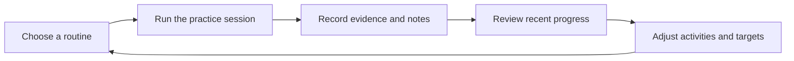
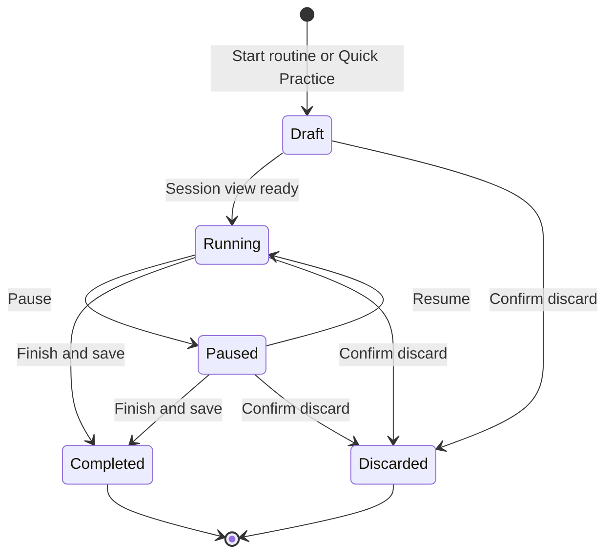
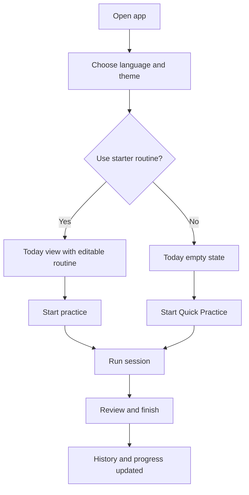
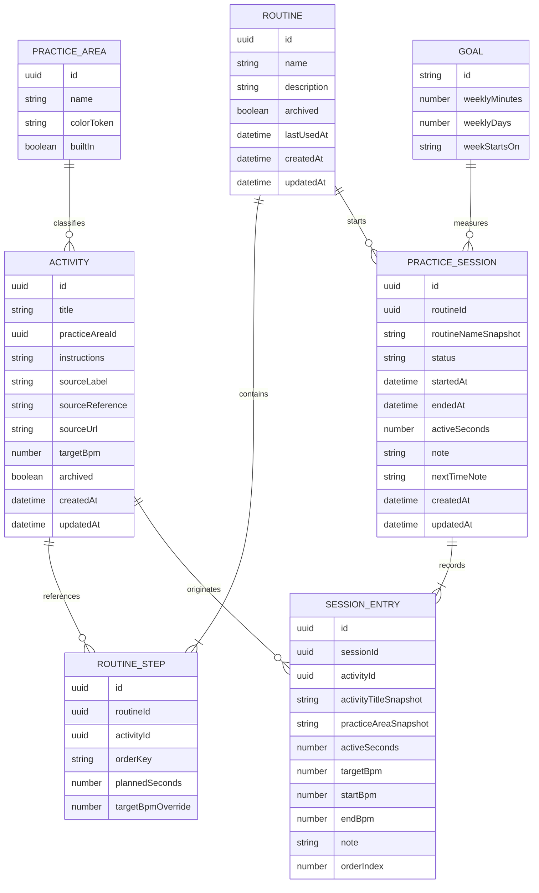
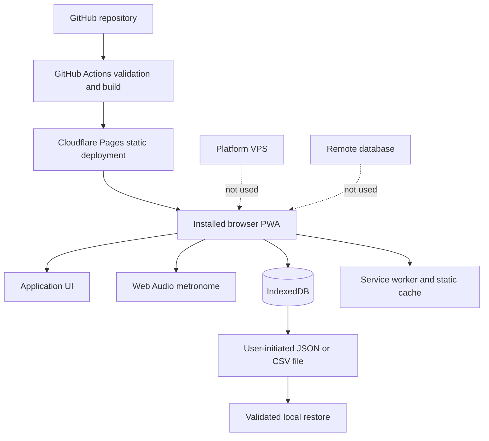
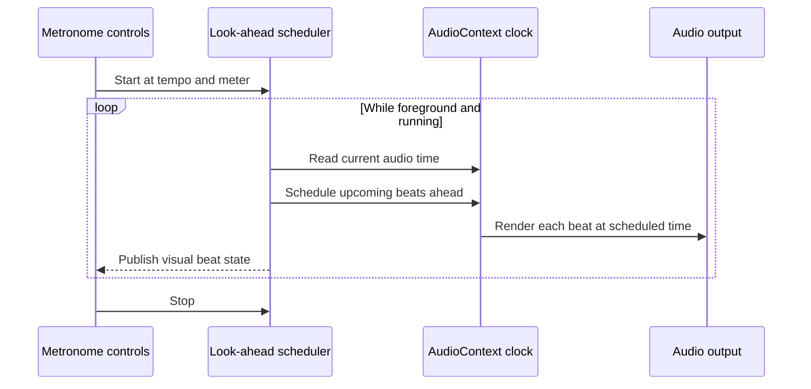

# Practice Companion Product Proposal

| Field | Value |
| --- | --- |
| Document | `BW-PRACTICE-CONCEPT-001` |
| Version | 0.1 |
| Status | Implemented as `bwinkeler-music-practice`; see the sibling documents in this `docs/` directory for the accepted decisions |
| Date | 2026-08-21 |
| Working product name | Practice Companion |
| Proposed service ID | `practice` |
| Proposed origin | `https://practice.bwinkeler.com` |
| Proposed repository | `bwinkeler-practice` |
| Primary user | A self-directed piano or keyboard learner |
| Runtime model | Static, installable, local-first web application |

> The Phase 1 scope of this proposal was built in `bwinkeler-music-practice`.
> The accepted architecture, requirement baseline, and decisions live in the
> sibling documents of this directory; this document remains the product concept
> and the rationale behind it.
>
> The service ID, npm package name, Pages project, IndexedDB database, and backup
> format keep the `practice` / `bwinkeler-practice` identifiers proposed here.
> Only the Git repository is named `bwinkeler-music-practice`.

## 1. Purpose of this document

This document preserves the product concept, scope, user experience, technical
direction, security posture, and implementation requirements for a future
Practice Companion application. It is intended to be sufficient context for a
new engineering session to evaluate and begin the project without depending on
the chat in which the idea originated.

This is not yet an accepted architecture decision or an implementation plan with
committed dates. Values labeled **proposed** should be reviewed before project
creation. Once implementation begins, accepted decisions should move into the
new repository as:

- `docs/REQUIREMENTS.md` for the requirement baseline;
- `docs/ARCHITECTURE.md` for application architecture;
- `docs/SERVICE_MANIFEST.md` for the operational contract;
- `docs/ADR/` for durable technical decisions;
- `docs/OPERATIONS.md` for deployment, backup, verification, and rollback.

The root platform architecture remains authoritative for shared platform rules.

## 2. Executive summary

Practice Companion is a focused personal workspace for organizing and recording
piano or keyboard practice. It complements lessons, books, videos, and online
courses; it does not attempt to replace a teacher or become another music course.

The central experience is deliberately small:

1. choose a reusable practice routine;
2. start a distraction-free session;
3. follow its ordered activities with a timer and metronome;
4. record short notes and optional tempo results;
5. finish the session and review progress over time.

The recommended first version is an installable Progressive Web App hosted on
Cloudflare Pages. All user data remains in the browser. It needs no account,
backend, database, VPS, or third-party analytics. After the first successful
load, the complete MVP works offline.

This architecture keeps operation inexpensive and minimizes the attack surface,
but browser storage is not guaranteed permanent storage. A full-fidelity JSON
backup and tested restore flow are therefore part of the MVP, not optional
extras. CSV export exists for analysis, not restoration.

Features that remain entirely on the device may be added incrementally, such as
Web MIDI input or microphone-based pitch assistance. Cross-device synchronization
is different: it introduces identity, remote storage, conflict resolution, and a
larger security responsibility. It must be treated as a separate product tier
with its own architecture decision rather than as a routine enhancement.

## 3. Product context

### 3.1 Problem

External piano and keyboard courses can provide instruction, repertoire, theory,
and exercises, but they do not necessarily provide one durable workspace that
fits the learner's own mix of materials. Practice details become scattered among
course platforms, notebooks, metronome apps, phone timers, and memory.

This makes several ordinary questions unnecessarily difficult:

- What should I practice today?
- How long did I actually spend on technique, reading, or repertoire?
- At what tempo did I comfortably play this exercise last time?
- What problem did I notice and what should I try next?
- Am I practicing consistently, or only consuming lesson content?

### 3.2 Opportunity

A small application can join planning, execution, reflection, and review without
becoming an educational platform. The useful loop is:



The product succeeds when it makes deliberate practice easier to start and
easier to review. It should never require more administration than the practice
it is meant to support.

### 3.3 Product position

> A private, offline-capable practice desk for planning piano or keyboard work,
> staying focused during a session, and remembering what to do next.

### 3.4 Relationship to learning material

Practice Companion may record the name of an external course, module, lesson,
book, score, or video and may link to a user-provided URL. It does not copy,
redistribute, scrape, or unlock third-party educational content.

The application should remain method-neutral. It must work equally well for a
formal piano course, popular keyboard study, private lessons, self-selected
repertoire, sight-reading, ear training, harmony, improvisation, and technique.

## 4. Goals, principles, and success criteria

### 4.1 Product goals

1. Make it possible to start a planned practice session in a few seconds.
2. Keep the learner focused on one activity at a time.
3. Combine a trustworthy session timer and practical metronome in one place.
4. Preserve concise evidence about time, tempo, difficulties, and next actions.
5. Show useful trends without turning practice into a competitive dashboard.
6. Work on desktop, tablet, and phone, online or offline after installation.
7. Keep practice data private by default and avoid unnecessary infrastructure.
8. Make backup and restoration understandable to a non-technical user.

### 4.2 Product principles

- **Practice before administration.** Common actions require few decisions and
  minimal typing.
- **One current action.** During a session, the interface emphasizes the current
  activity rather than the entire application.
- **Evidence over judgment.** The app records time, tempo, notes, and consistency;
  it does not claim to score musical quality.
- **Flexible structure.** The learner can follow a course without being forced
  into a curriculum designed by the application.
- **Local by default.** A feature does not introduce a server unless sharing or
  remote synchronization is genuinely required.
- **Honest reliability.** The product must explain browser-storage and reminder
  limitations instead of implying guarantees it cannot provide.
- **Accessible through more than sound.** Every audio-dependent interaction has
  an equivalent visual state.
- **Calm, not gamified.** Consistency can be acknowledged, but missed days should
  not create shame, punishment, or artificial urgency.

### 4.3 Proposed success criteria

These criteria can be evaluated locally without analytics or telemetry:

| Criterion | Proposed target |
| --- | --- |
| First useful result | A new user can create or select a starter routine and save a completed session within three minutes. |
| Recurring use | A returning user can start the last-used routine within 20 seconds. |
| Session focus | Starting, pausing, advancing, and finishing a session never requires leaving the session view. |
| Recovery | A user can export, delete local data, and restore an equivalent state from JSON in a tested end-to-end flow. |
| Offline operation | Every MVP flow works after an offline reload following the first successful load. |
| Accessibility | Core flows meet WCAG 2.2 AA and complete with keyboard-only input. |
| Operational simplicity | The production runtime has no application server, database, VPS route, or secret. |

Usage frequency is a personal product outcome, not something the application
should transmit. The owner can evaluate after four to six weeks whether the app
is being used for at least three sessions per week and whether its weekly review
changes practice decisions.

## 5. Users and use cases

### 5.1 Primary user

The MVP supports one implicit local profile per browser installation: an adult
self-directed piano or keyboard learner who combines one or more external
courses with exercises and repertoire.

The user may practice at a digital piano with a laptop or tablet on the music
stand, or may review history from a phone. The application should assume that
hands are often occupied and that the practice screen may be viewed from farther
away than a normal productivity application.

### 5.2 Secondary future users

- a teacher helping a student define a routine on the student's device;
- another family member using a separate browser profile or device;
- a MIDI-keyboard learner who wants automatic note or tempo evidence.

Multiple profiles on the same installation are not part of the MVP. Shared
teacher accounts, social features, leaderboards, and public profiles are outside
the proposed product direction.

### 5.3 Jobs to be done

| Situation | User job | Desired result |
| --- | --- | --- |
| Beginning daily practice | Select an appropriate routine without reconstructing it from memory | Practice starts quickly |
| Working through a course | Associate activities with a course, module, or lesson | External learning material and personal practice remain connected |
| Practicing technique | Use a target tempo and timer without opening separate tools | The current task stays visible and measurable |
| Encountering a problem | Capture a short observation or next action | The next session begins with context |
| Ending a session early | Save the work that actually happened | History remains honest rather than all-or-nothing |
| Reviewing the week | Compare time across practice areas and days | The next routine can be adjusted intentionally |
| Changing devices or clearing storage | Export and restore the complete practice record | The learner controls recovery |

### 5.4 Core scenarios

#### Scenario A: recurring weekday practice

The user opens the installed app, sees the most recent routine, and presses
Start. The app shows the first activity, planned duration, notes, and target
tempo. The user runs the metronome if needed, moves through the routine, records
a brief note, and finishes. The completed session appears in history and weekly
progress.

#### Scenario B: course lesson follow-up

The user creates an activity called `Lesson 12 - left-hand accompaniment`, adds
the course and lesson reference, places it in a routine, and records the tempo
reached without tension. On the next session, the previous note and latest tempo
are available from the activity details.

#### Scenario C: unplanned practice

The user selects Quick Practice, chooses or creates one activity, and starts the
timer without building a complete routine. The result is stored exactly like a
planned session and contributes to progress statistics.

#### Scenario D: recovery

The application indicates that no backup has been exported recently. The user
downloads a JSON backup. Later, after reinstalling or changing browsers, the user
imports the file, reviews its date and record counts, confirms replacement, and
recovers routines, activities, sessions, goals, and settings.

## 6. Scope and release phases

### 6.1 Phase boundary rule

A feature remains in the local-first product only when it needs no application
server, no remote identity, and no transmission of user data. A feature that
breaks any of these conditions requires a new ADR, threat model, service
manifest, backup policy, and operational plan.

### 6.2 Phase 1: minimum useful product

The MVP includes:

- a first-run experience and optional starter routine;
- reusable practice activities;
- reusable ordered routines;
- Quick Practice for an unplanned single activity;
- a foreground session runner;
- elapsed and per-activity timers;
- a Web Audio metronome;
- session and activity notes;
- optional starting and ending tempo records;
- weekly goals for minutes and practice days;
- history and simple progress views;
- complete JSON backup and restore;
- session CSV export;
- local persistence with schema migrations;
- installable PWA behavior and full offline operation;
- Brazilian Portuguese and English user-interface architecture;
- light and dark themes;
- responsive and accessible core flows;
- secure static deployment to Cloudflare Pages.

### 6.3 Phase 2: local-device enhancements

Phase 2 may include, only after actual use of the MVP:

- Web MIDI input and device-status display;
- a Screen Wake Lock while a session is active;
- routine templates for common study patterns;
- custom tags and richer filters;
- a simple practice calendar;
- optional count-in and subdivisions in the metronome;
- best-effort in-app schedule reminders;
- print-friendly weekly summaries;
- local file-system backup where the File System Access API is available.

Web MIDI should initially record only explicit, understandable evidence, such as
notes played during a user-initiated diagnostic. It should not attempt automatic
musical grading without a separate product and pedagogical specification.

### 6.4 Phase 3: audio and local references

Potential Phase 3 features are:

- microphone-based pitch or tuning assistance;
- sustained-note stability feedback;
- user-provided local reference audio;
- user-provided scores or images stored only on the device;
- storage-quota management for local files.

Microphone features must be opt-in, process audio entirely on the device, never
record by default, never transmit audio, and remain usable with a non-audio
fallback. Reference files must never become a third-party score repository or a
sharing mechanism.

### 6.5 Separate future tier: synchronization

Cross-device synchronization is explicitly excluded through Phase 3. Manual
JSON export and restore are the supported transfer mechanism.

If synchronization becomes necessary, the decision must compare at least:

- a private authenticated backend on the existing platform;
- user-owned storage such as WebDAV or a cloud-drive file;
- end-to-end encryption and its key-recovery consequences;
- conflict rules for simultaneous edits;
- server-side backup, retention, deletion, and account recovery;
- Cloudflare Access versus application-owned identity;
- operating cost and incident response.

Synchronization must not silently convert an anonymous local app into a public
registration service.

### 6.6 Explicit non-goals

The product is not:

- a piano course or curriculum;
- a replacement for a teacher;
- a sheet-music marketplace or repository;
- a digital audio workstation or multitrack recorder;
- a music-notation editor;
- a social network, leaderboard, or practice competition;
- an automatic judge of expression, posture, tension, or musicality;
- a public content scraper;
- a medical, therapeutic, or accessibility diagnostic tool;
- a password vault for course credentials;
- an account-based cloud service in its initial form.

## 7. Functional design

### 7.1 First run and onboarding

The first run should ask only for decisions that change the immediate experience:

1. interface language, with Brazilian Portuguese proposed as the default and
   English available;
2. light, dark, or device theme;
3. whether to create a starter routine.

No account, name, email, instrument brand, skill-level questionnaire, or
notification permission is required. A short storage notice should state that
data remain on this device and should be backed up periodically.

The proposed starter routine is editable and contains:

| Activity | Practice area | Planned time |
| --- | --- | ---: |
| Warm-up | Technique | 5 minutes |
| Scales or chords | Technique | 10 minutes |
| Current lesson | Study | 10 minutes |
| Repertoire | Repertoire | 15 minutes |

The learner may decline it and begin with an empty state.

### 7.2 Practice activities

An activity is a reusable unit of work, such as `C major scale`, `Sight-reading`,
`Lesson 12`, or `Autumn Leaves - left hand`.

Each activity supports:

- title;
- practice area;
- optional instructions or notes;
- optional source label, such as course or book name;
- optional source reference, such as module and lesson;
- optional safe external URL opened only by explicit user action;
- optional target tempo in beats per minute;
- active or archived state;
- creation and modification timestamps.

Proposed built-in practice areas are:

- Technique;
- Scales and chords;
- Sight-reading;
- Repertoire;
- Ear training;
- Rhythm;
- Harmony and theory;
- Improvisation;
- Course study;
- Custom.

The built-in set is a convenience, not a taxonomy the user must follow. A custom
label can be added without changing the application.

Activities should normally be archived rather than deleted. Historical session
entries preserve a snapshot of the activity title and area, so history remains
readable even after an activity changes or is removed.

### 7.3 Practice routines

A routine is a reusable ordered set of activity steps. Examples include
`Weekday 30 minutes`, `Weekend repertoire`, and `Course lesson review`.

A routine supports:

- name;
- optional description;
- ordered steps;
- planned duration per step;
- an optional step-specific target tempo;
- active or archived state;
- manual duplication;
- total planned duration calculated from its steps;
- last-used date.

The editor should allow activities to be created inline so the user is not
forced through a separate library-management flow. Reordering must always have
an explicit keyboard- and touch-friendly method, such as Move up and Move down.
Drag-and-drop is optional polish, not the only interaction.

The application does not automatically schedule or modify routines in the MVP.
The user chooses what to practice.

### 7.4 Today view

The Today view is the normal entry point. It presents:

- a prominent Resume panel when a session is active or paused;
- the last-used routine as the primary start option;
- recent or pinned routines;
- a Quick Practice action;
- current weekly minutes and practice-day goal progress;
- the latest unresolved `Next time` note, when available;
- a restrained backup-status warning when appropriate.

It should not resemble a marketing landing page. The product itself is the first
screen.

### 7.5 Quick Practice

Quick Practice starts a session from one existing or newly created activity. It
supports the same timer, metronome, notes, tempo record, and completion flow as a
routine session. It does not create a permanent one-step routine unless the user
chooses Save as routine after finishing.

### 7.6 Session runner

Starting a routine creates a draft session and opens a dedicated practice view.
The practice view contains:

- routine and current activity names;
- current step and total step count;
- total elapsed session time;
- current-activity elapsed time;
- planned activity duration, shown as guidance rather than a forced deadline;
- previous and next activity controls;
- pause, resume, finish, and discard controls;
- activity instructions and the most recent `Next time` note;
- optional starting and ending tempo fields;
- a compact metronome control strip;
- a note field for observations;
- an optional `Next time` field for the next concrete action.

The user can spend more or less than the planned time. Advancing never silently
marks an activity as musically mastered. A partial session is valid and should
be saved honestly.

#### Session lifecycle



A completed session is saved atomically. Closing or refreshing during an active
session must not erase it. On the next launch, the user can resume or discard the
recovered draft.

### 7.7 Timer behavior

The timer is based on timestamps and accumulated paused duration, not on counting
`setInterval` ticks. This prevents normal browser throttling from creating large
errors when the tab is temporarily hidden.

Required behavior:

- start, pause, resume, finish, and discard are explicit;
- the display updates smoothly while visible;
- an active session can recover after refresh or an application restart;
- elapsed time is derived from wall-clock deltas;
- manual duration correction is available from session history;
- a date or timezone change does not produce a negative duration;
- the timer may remain accurate in the background, but the metronome is only
  guaranteed while the app is visible and in the foreground.

A future Screen Wake Lock can reduce accidental screen sleep, but the app must
remain usable on browsers that do not support it.

### 7.8 Metronome

The MVP metronome should support:

- proposed tempo range of 30 to 300 BPM;
- direct numeric input and stepper controls;
- tap tempo based on a recent rolling sample;
- 2/4, 3/4, 4/4, and 6/8 meters;
- a distinct downbeat accent;
- volume and mute controls;
- start and stop independent of the session timer;
- a clear visual beat cue;
- preservation of the most recent settings on the device.

Audio must use the Web Audio clock with a short look-ahead scheduler. A simple
`setInterval` that emits sound immediately is not acceptable because main-thread
delays create audible drift. Audio starts only after a user gesture to comply
with browser autoplay rules.

The metronome is a practice aid, not a laboratory timing instrument. Supported
behavior should be validated on the actual target laptop, tablet, and phone. If
the document is baselined as requirements, a proposed quality target is no
missed beats during a ten-minute foreground run at 120 BPM on supported devices.

The visual cue must not flash rapidly across a large area. It should distinguish
the downbeat through shape, position, or contrast as well as color. Screen readers
must receive start, stop, and tempo changes but must not announce every beat.

### 7.9 Notes and reflection

The app provides two deliberately short text concepts:

- **Session note:** what happened during this session;
- **Next time:** one problem or action to revisit.

Notes are plain text in the MVP. They do not execute HTML and do not require a
Markdown renderer. Suggested prompts may include:

- What improved?
- Where did tension or hesitation appear?
- Which passage needs slower practice?
- What is the first action for the next session?

Prompts are optional and should disappear once typing begins. The app should not
force journaling at the end of every activity.

### 7.10 Tempo evidence

An activity or session entry may store:

- target tempo;
- starting tempo;
- ending comfortable tempo.

Tempo is self-reported. The interface must not label a higher number as an
automatic improvement because musical quality, accuracy, relaxation, and style
are not represented by BPM alone. Tempo history should be shown as evidence with
the associated dates and notes, not as a performance score.

### 7.11 Weekly goals

The MVP supports two optional goals:

- planned practice minutes per week;
- planned practice days per week.

Goals reset according to the user's local calendar week. A missed target should
receive neutral language. The application does not use loss aversion, broken
streak warnings, or red failure states.

### 7.12 History

History provides a reverse-chronological list of completed sessions with:

- date and local start time;
- actual duration;
- routine or Quick Practice label;
- practiced activities and their durations;
- recorded tempos;
- session note and `Next time` note;
- edit and delete actions.

The user can filter by date range, practice area, routine, or activity. The MVP
may start with date and activity filters if the complete set would delay the first
release.

Editing a historical session updates statistics consistently. Deletion requires
confirmation and is permanent after the transaction succeeds.

### 7.13 Progress

The initial Progress view should answer a few concrete questions:

- How many minutes did I practice this week?
- On how many days did I practice?
- How is time divided among practice areas?
- Which activities have I practiced recently?
- How has a manually recorded tempo changed for one selected activity?

Proposed visualizations are:

- seven daily bars for the selected week;
- a practice-area distribution bar or compact list;
- recent activity frequency;
- an optional selected-activity tempo line.

Every chart must have an accessible data table or equivalent textual summary.
Statistics use local-time calendar boundaries and must handle daylight-saving
transitions. Duration totals are based on recorded elapsed seconds, not rounded
display values.

Streaks, if implemented, are secondary and informational. A current practice-day
streak must never dominate the Progress view.

### 7.14 Backup, restore, and export

#### JSON backup

JSON is the authoritative recovery format. A backup includes:

- format identifier;
- schema version;
- application version;
- export timestamp;
- activities;
- routines and step order;
- completed and draft sessions;
- goals;
- user-created practice areas;
- relevant settings;
- record counts and an integrity checksum.

The default filename should be predictable, for example:

```text
practice-companion-backup-2026-08-21.json
```

Restore is a full replacement in the MVP. Before replacement, the app shows the
backup date, schema version, and record counts and asks for confirmation. The
restore is validated fully before a single local record changes and is committed
as one transaction. A failed restore leaves the current database unchanged.

The UI should strongly encourage exporting the current state before replacement.
Automatic downloads without a user gesture are not assumed.

#### CSV export

CSV is a human-readable analytical export of completed session entries. It is
not a complete backup and is not imported by the MVP. Proposed columns are:

```text
session_id,date,start_time,duration_minutes,routine,activity,practice_area,
activity_minutes,target_bpm,start_bpm,end_bpm,session_note,next_time_note
```

Cells beginning with spreadsheet formula characters such as `=`, `+`, `-`, or
`@` must be neutralized to prevent formula injection when the file is opened in
spreadsheet software.

#### Backup reminders

The Settings view displays the date of the last successful export known to the
application. A quiet reminder can appear after a proposed 14 days or ten newly
completed sessions, whichever comes first. This is a reminder, not proof that the
downloaded file still exists.

### 7.15 Settings and data management

Settings include:

- interface language;
- theme;
- week start day;
- default metronome meter, sound, and volume;
- weekly goals;
- storage persistence status where the browser exposes it;
- last known backup export date;
- export backup;
- restore backup;
- export CSV;
- delete all local data;
- application version and update status.

Deleting all data requires a clear confirmation that includes the number of
sessions to be removed. The app should offer a backup action in the same flow.

### 7.16 Offline and updates

After the first successful load, the app shell and every MVP feature work without
network access. The interface should indicate offline status only when it affects
an action, not as a persistent alarm.

Service-worker updates use a prompt strategy. A new version must never force a
reload during an active or paused session. The update can be applied after the
session is completed or explicitly discarded.

## 8. Information architecture and navigation

### 8.1 Primary destinations

| Destination | Purpose |
| --- | --- |
| Today | Start or resume practice and see the immediate weekly context |
| Routines | Create and organize reusable practice routines and activities |
| History | Review and edit completed sessions |
| Progress | Inspect time, consistency, practice areas, and selected tempo history |
| Settings | Configure the device, backup data, restore, update, or delete data |

An active session is a focused mode rather than another persistent navigation
destination.

### 8.2 Responsive navigation

- **Phone:** a stable bottom navigation bar for the five primary destinations;
  an active session replaces it with session controls.
- **Tablet:** a compact navigation rail or bottom bar depending on orientation;
  the practice view must work well in landscape on a music stand.
- **Desktop:** a narrow left navigation rail and a constrained main workspace;
  avoid stretching forms or history rows across the full monitor.

Navigation dimensions must remain stable when labels, badges, timers, or offline
state change.

### 8.3 Route proposal

```text
/
/routines
/routines/new
/routines/:routineId
/activities/:activityId
/practice/quick
/practice/:sessionId
/history
/history/:sessionId
/progress
/settings
```

The application can use client-side routing with a static fallback, provided the
Cloudflare Pages deployment and offline service worker both support direct route
loads.

## 9. Key user flows

### 9.1 First session



### 9.2 Create a routine

1. Select New routine.
2. Enter a name and optional description.
3. Add an existing activity or create one inline.
4. Set a suggested duration and optional tempo.
5. Repeat as needed.
6. Reorder with explicit controls.
7. Save and optionally start immediately.

Unsaved changes are protected from accidental navigation. The editor should not
require a modal for each step.

### 9.3 Finish a session

1. Select Finish.
2. Review actual duration and activity entries.
3. Add or revise the session note and `Next time` note.
4. Adjust an obviously incorrect duration if necessary.
5. Save.
6. Return to Today with a compact completion summary.

No celebratory animation should delay the next action. Reduced-motion settings
must be respected.

### 9.4 Restore a backup

1. Open Settings and select Restore backup.
2. Choose a local JSON file.
3. Validate file size, format, schema, and all records without writing data.
4. Display export date, app version, and record counts.
5. Offer Export current data.
6. Confirm full replacement.
7. Commit the replacement atomically.
8. Recalculate derived statistics and show a restoration summary.

## 10. UX states and error behavior

Every major view must define useful empty, success, and failure states.

| State | Expected behavior |
| --- | --- |
| No routines | Offer starter routine, New routine, and Quick Practice without explanatory clutter |
| No history | Explain that completed sessions appear here and provide a Start action |
| Active session recovered | Show elapsed state and explicit Resume or Discard choices |
| Offline | Continue all MVP functions; defer only update checks or external links |
| Storage persistence denied | Explain that browser storage may be removed and recommend installation plus backup |
| Storage quota exceeded | Reject the write safely, preserve existing data, and offer export/data management |
| Invalid backup | Report the exact category of failure without partially importing records |
| Newer backup schema | Refuse unsupported import and preserve current data |
| Update available | Offer update after the active session ends |
| Audio unavailable | Keep timer and visual beat controls available; explain the browser limitation |
| External link unavailable | Preserve the activity and allow practice without the source page |
| Unexpected error | Preserve the active draft when possible and expose a safe recovery action |

Destructive actions must identify what will be removed. Error messages should be
actionable and should not expose stack traces, raw imported content, or internal
database details.

## 11. Visual and interaction direction

### 11.1 Design character

The interface should feel like a **quiet practice studio with precise instrument
controls**, not a generic project-management dashboard and not a music-themed
marketing page. The product should balance warmth with visual accuracy.

Recommended qualities:

- light theme by default, with a fully designed dark option;
- high-contrast neutral surfaces rather than a single-color theme;
- a restrained combination of deep green, lacquer red, clear blue, and warm
  brass accents for different semantic roles;
- visible rhythm and spacing inspired by printed music without using decorative
  staves everywhere;
- typography that remains readable from a music stand;
- large, stable timer digits using tabular numerals;
- subtle transitions only where they explain state changes.

An initial palette direction, subject to contrast validation, is:

| Token | Light direction | Purpose |
| --- | --- | --- |
| Canvas | cool near-white | Main background |
| Surface | white | Controls, repeated list items, and dialogs |
| Ink | near-black green | Primary text |
| Muted | neutral gray-green | Secondary text |
| Primary | deep green | Start, resume, and selected state |
| Stop | lacquer red | Stop and destructive confirmation |
| Tempo | clear blue | Metronome and tempo evidence |
| Accent | muted brass | Goals and restrained highlights |

The final palette must be tested rather than accepted from token names alone. A
dark theme should reassign contrast deliberately instead of mechanically
inverting colors.

### 11.2 Typography

A possible type direction is:

- a self-hosted expressive serif such as Newsreader for page and routine titles;
- a self-hosted humanist sans such as IBM Plex Sans for controls and body text;
- tabular numeric forms, or IBM Plex Mono where necessary, for timers and BPM.

Typography is a design recommendation, not a dependency requirement. Fonts must
be self-hosted, subset where practical, and included in the performance budget.
The application must remain legible if custom fonts fail to load.

### 11.3 Component behavior

- Use familiar icons for play, pause, stop, skip, add, edit, archive, export, and
  settings, with accessible names and tooltips where meaning is not obvious.
- Use segmented controls for meter and compact mode choices.
- Use steppers, direct numeric input, and tap tempo for BPM.
- Use toggles only for immediate binary settings.
- Use dialogs only for confirmation, import preview, or genuinely interrupting
  decisions.
- Use cards for repeated routines or sessions, not as wrappers around every page
  section.
- Keep corner radii restrained at 8 pixels or below unless a future design
  system establishes another value.
- Do not nest cards inside cards.
- Preserve stable dimensions for timer, beat indicator, transport controls, and
  navigation so state changes do not shift the layout.

### 11.4 Practice view composition

On landscape tablet or desktop, the session view should use two functional
regions:

- the dominant left region for current activity, timers, instructions, and
  session transport;
- a narrower right region for the metronome, tempo evidence, notes, and upcoming
  steps.

On phone portrait, it becomes one vertical flow:

1. activity and step status;
2. stable timer;
3. session transport;
4. metronome controls;
5. instructions and notes;
6. upcoming activities.

The Stop action must be visually distinct from Pause and require confirmation
only when it would discard unsaved work. Finishing and saving is not presented as
a destructive action.

### 11.5 Motion and sound

Motion should communicate session start, pause, step change, and saved state. It
must not animate continuously merely because a timer is running. The visual
metronome cue is the exception, and it should remain compact.

The metronome should use a short synthesized click or bundled sound with a
distinct but non-startling downbeat. No background music, achievement sound, or
automatic audio is appropriate.

## 12. Accessibility requirements

The target is WCAG 2.2 AA for all MVP flows.

Required practices include:

- complete keyboard access to navigation, routine editing, session controls,
  metronome, history, settings, export, and restore;
- a visible focus indicator with sufficient contrast;
- no drag-only reordering;
- no audio-only information;
- no color-only distinction for beat, state, goal, or error;
- semantic headings, landmarks, lists, dialogs, forms, labels, and status
  messages;
- live-region announcements for session start, pause, step change, completion,
  and errors, but not for every timer tick or metronome beat;
- support for browser zoom and text resizing without horizontal page scrolling at
  320 CSS pixels;
- touch targets of at least 24 by 24 CSS pixels, with larger primary transport
  controls suitable for use near a keyboard instrument;
- `prefers-reduced-motion` support;
- contrast of at least 4.5:1 for normal text and 3:1 for large text and essential
  graphical controls;
- chart data available in a table or concise textual summary;
- validation messages associated programmatically with their fields;
- focus restoration after dialogs close;
- no focus loss when a routine step is added, moved, or removed.

Real-device manual testing should include keyboard-only desktop use, VoiceOver on
an iPhone or iPad, and at least one Android screen reader if Android is included
in the supported browser matrix.

## 13. Localization and writing

### 13.1 Recommended language policy

- Code, identifiers, engineering documentation, commits, and repository metadata
  remain in English.
- The public UI is proposed as Brazilian Portuguese by default with English as an
  option.
- All UI strings live in typed locale catalogs from the first implementation.
- Practice activities and notes entered by the user are never translated.

The final default language is an open product decision. Building localization
structure from the beginning is recommended because retrofitting it affects data
labels, date formatting, accessibility names, tests, and layouts.

### 13.2 Writing style

Interface language should be concise, direct, neutral, and non-judgmental.

Prefer:

- `Practice on 3 days this week`
- `12 minutes remaining in the plan`
- `Last backup recorded 16 days ago`

Avoid:

- `You failed your weekly goal`
- `Do not lose your streak`
- `Become a piano master`
- unsupported claims that the app will make the user learn faster.

## 14. Data model

### 14.1 Data ownership

All practice data belongs to the local user and remains on the current browser
installation unless the user explicitly exports a file. The application sends no
practice data to `bwinkeler.com`, Cloudflare application code, analytics, or any
third party.

### 14.2 Conceptual entities



Exact storage fields may change during implementation, but these invariants
should remain:

- history contains snapshots so edits do not rewrite the past;
- durations are stored in integer seconds or milliseconds, never display text;
- timestamps are stored as ISO 8601 instants and presented in local time;
- calendar aggregation uses the user's local timezone at calculation time;
- routine order is explicit and deterministic;
- every persisted document belongs to a versioned schema;
- derived statistics can be rebuilt from session records.

### 14.3 Validation constraints

Proposed defensive limits are:

| Field | Limit |
| --- | ---: |
| Activity or routine title | 120 Unicode characters |
| Short source/reference label | 200 Unicode characters |
| URL | 2,048 characters and `https:` only by default |
| Note or instructions | 10,000 Unicode characters |
| Routine steps | 100 per routine |
| BPM | Integer from 30 through 300 |
| Imported JSON file | 5 MiB before attachments exist |

Limits should be enforced in both forms and import validation. They are proposed
guardrails and can be changed before baselining.

### 14.4 Schema migration

The local database and backup format have explicit, independent version numbers.
On application load, supported older database versions migrate forward in a
transaction. Migrations require fixtures and tests. An unsupported newer backup
must be rejected with no partial write.

## 15. Recommended architecture

### 15.1 Runtime topology



Cloudflare serves static files and does not execute practice logic or store user
records. The platform VPS, Caddy, and PostgreSQL are not in the runtime path.

### 15.2 Proposed stack

The final stack should be selected when implementation begins, independently of
other products. A suitable starting point is:

| Concern | Recommendation | Reason |
| --- | --- | --- |
| Language | TypeScript | Strong contracts for state, persistence, import, and locale catalogs |
| Build | Vite | Existing platform familiarity and straightforward static output |
| UI | React | The application has state-heavy forms, routing, session recovery, and derived views |
| Routing | React Router or a small equivalent | Direct, testable application routes |
| Local database | IndexedDB through Dexie | Versioned transactions and structured queries without hand-written IndexedDB plumbing |
| Validation | Zod or equivalent schema validator | One explicit boundary for forms, migrations, and imported backups |
| PWA | `vite-plugin-pwa` with prompt updates | Existing platform pattern and testable offline support |
| Audio | Native Web Audio API | Precise scheduling without a server or large media dependency |
| Icons | Lucide | Familiar controls and an existing accessible icon vocabulary |
| Unit tests | Vitest | Fast TypeScript tests and existing platform familiarity |
| Browser tests | Playwright | Real offline, persistence, responsive, and recovery flows |
| Hosting | Cloudflare Pages | Static runtime with no VPS dependency |

This is a recommendation, not a requirement to copy the Listly or KeyPlay stack.
React is proposed because this product has more persistent and derived UI state
than KeyPlay. A different choice should document how it reduces complexity
without weakening testability or accessibility.

WebAssembly is unnecessary for the MVP. Web Audio, IndexedDB, timers, charts,
and data validation are well served by browser and TypeScript APIs.

### 15.3 Storage approach

Use IndexedDB for all user-owned structured data. A tiny synchronous preference,
such as the early theme value needed to prevent a flash, may use `localStorage`,
but it must not become a second source of truth for practice records.

On the first meaningful write, the application should request persistent storage
through `navigator.storage.persist()` where available and expose the result in
Settings. A granted request reduces eviction risk but does not make local storage
a guaranteed backup.

### 15.4 Audio scheduling

The metronome separates UI updates from sound scheduling:



The audio clock controls beat timing; rendering or React state must not. A
diagnostic interface may expose scheduled beat times to automated tests without
exposing mutation hooks in production.

### 15.5 Progressive enhancement

The core app works without MIDI, microphone, Wake Lock, notifications, or File
System Access. Each optional browser capability requires feature detection and a
clear unavailable state. Browser permissions are requested only when the user
starts the associated feature, never during first-run onboarding.

## 16. Privacy and security

### 16.1 Data classification

Practice records are private personal data. They may reveal habits, schedules,
interests, course usage, and free-text observations. They are less sensitive
than passwords or financial data but should not be treated as public telemetry.

The MVP stores no email address, account credential, payment information, precise
location, contact list, or server identity.

### 16.2 Threat model

| Threat | Consequence | MVP controls | Residual limitation |
| --- | --- | --- | --- |
| Malicious or compromised dependency | Script can read all local data | Few dependencies, lockfile, review, automated audit, pinned actions, strict CSP, no third-party runtime scripts | A trusted same-origin script remains powerful |
| Cross-site scripting | Notes or imports execute code | React text rendering, no raw HTML, strict CSP, validated URLs, no Markdown in MVP | Future rich text requires a new review |
| Malicious backup file | Memory exhaustion, prototype pollution, invalid records, or script content | File-size cap, strict schema, dangerous-key rejection, plain-text rendering, all-or-nothing transaction | User must still choose files carefully |
| Spreadsheet formula injection | CSV opens an executable formula | Neutralize formula-leading cells and quote fields correctly | Spreadsheet software behavior varies |
| Browser storage eviction | Practice history is lost | PWA installation guidance, persistent-storage request, backup reminders, JSON export/restore | Browser storage is never guaranteed durable |
| Shared or stolen device | Another local user reads practice data | Rely on OS account lock and device encryption; provide Delete all data | No application-level identity in MVP |
| Service-worker update during practice | Active session state is interrupted | Prompt update, persisted draft, no forced reload | Browser or OS can still terminate a tab |
| External source URL | User visits a malicious site | Explicit navigation, `https:` validation, `noopener`/`noreferrer`, no embedded third-party pages | The destination is outside app control |
| Future microphone or MIDI access | Unexpected sensor access or data disclosure | Just-in-time permission, local processing, visible active state, no network transmission | Browser and OS permission indicators remain authoritative |
| Physical data corruption | Backup or database becomes unreadable | Versioning, transaction boundaries, import checksum, tested restore | A checksum does not replace multiple backup copies |

### 16.3 Security requirements

- No secrets, API tokens, private keys, or passwords ship in the static bundle.
- No third-party analytics, advertising, embedded players, remote fonts, or
  runtime JavaScript are loaded.
- Notes and imported strings render as text, never as raw HTML.
- Imported JSON is treated as untrusted input and validated before use.
- Keys named `__proto__`, `prototype`, or `constructor` are rejected wherever
  arbitrary object keys could be interpreted.
- Restore failures leave the current database unchanged.
- External URLs accept only an explicit allowlist of safe protocols.
- Dependencies and GitHub Actions are version-pinned and reviewed before updates.
- Production source maps are either omitted or deliberately published after a
  documented decision; they must contain no secrets in either case.
- The app is not embedded by other origins.
- HTTPS is mandatory in production.

### 16.4 Proposed response headers

The exact header file must be validated against the finished build. The intended
policy is approximately:

```text
Content-Security-Policy: default-src 'none'; base-uri 'none'; form-action 'none'; frame-ancestors 'none'; object-src 'none'; script-src 'self'; style-src 'self'; img-src 'self' data: blob:; font-src 'self'; media-src 'self' blob:; connect-src 'self'; worker-src 'self'; manifest-src 'self'
Referrer-Policy: no-referrer
X-Content-Type-Options: nosniff
Permissions-Policy: camera=(), geolocation=(), payment=(), usb=()
```

The microphone and MIDI policy must remain disabled until those features exist.
The CSP should be tightened to the actual artifact rather than weakened to make
an unexpected dependency work. Inline scripts and `unsafe-eval` are not allowed.

### 16.5 Privacy requirements

- No practice event is sent off the device.
- No analytics identifier or fingerprint is created.
- No network request is required to start or finish a session after installation.
- The privacy explanation names IndexedDB, offline cache, export files, and
  browser-eviction limits in ordinary language.
- Deleting all data removes practice records, settings, and caches controlled by
  the application as far as browser APIs permit.
- Future microphone processing is local and ephemeral unless the user explicitly
  saves a derived result.

### 16.6 Encryption stance

The MVP does not add an application password or custom encryption at rest. In a
fully local application, retaining a decryption key in the same browser often
creates an illusion of protection. Device login, browser profile separation, and
full-device encryption are the appropriate controls for local theft.

If remote synchronization or highly sensitive journal content is introduced,
encryption and key recovery require a separate design.

## 17. Reliability, recovery, and data lifecycle

### 17.1 Local-storage limitation

IndexedDB is persistent browser storage, but it can still be cleared by the user,
browser, device-management policy, storage pressure, private-browsing behavior,
or operating-system cleanup. Installation and a successful persistent-storage
request reduce risk but do not remove it.

The UI and documentation must never call the local database a guaranteed backup.

### 17.2 Recovery strategy

The supported recovery strategy is:

1. maintain the current local database;
2. prompt for periodic user-initiated JSON exports;
3. keep backup format migrations tested;
4. validate and preview before restore;
5. replace data atomically;
6. test a real restore before declaring the feature complete.

The user should keep exported backups in a location already covered by personal
device backup, such as an encrypted personal drive. The application itself does
not choose or upload to that location.

### 17.3 Retention

Completed sessions remain until the user deletes them. Archiving an activity or
routine hides it from normal selection without removing history. There is no
automatic deletion in the MVP.

## 18. Performance and browser support

### 18.1 Performance goals

Proposed budgets for the first release are:

- initial JavaScript at or below 250 KiB compressed;
- total initial application transfer at or below 1 MiB, excluding optional
  later user media;
- Largest Contentful Paint below 2.5 seconds on a representative mid-range phone
  over a normal mobile connection;
- visible response to a local control within 100 milliseconds;
- no layout shift when timer digits, navigation badges, or beat state change;
- progress calculations for 10,000 session entries complete without blocking the
  interface for more than one animation frame at a time.

These are proposed constraints and should be measured on the actual build. The
artifact checker should fail CI when an accepted size budget is exceeded.

### 18.2 Supported environments

The proposed baseline is the current stable versions of:

- Chromium-based desktop browsers;
- Firefox desktop;
- Safari desktop;
- Safari on iOS and iPadOS;
- Chrome on Android.

PWA installation, persistent storage, Wake Lock, MIDI, and file-system features
vary by browser. The MVP cannot require optional APIs. Playwright WebKit is useful
but does not replace manual testing on a real iPhone or iPad.

### 18.3 Background behavior

The elapsed timer recovers from timestamp data after backgrounding. Continuous
metronome playback, notifications, and wake behavior are not guaranteed while
the browser is hidden, the device is locked, or the operating system suspends the
page. The product should optimize the normal foreground practice case and state
these limits honestly.

## 19. Testing and quality strategy

### 19.1 Unit tests

Unit tests should cover:

- timer elapsed-time calculations across pause, resume, reload, clock movement,
  and timezone changes;
- metronome beat scheduling, meter accents, tap-tempo filtering, and BPM bounds;
- weekly statistics across local-midnight and daylight-saving transitions;
- routine ordering and snapshot creation;
- database and backup schema migrations;
- complete import validation and rejection paths;
- prototype-pollution keys;
- CSV escaping and formula neutralization;
- localization-key parity;
- goal calculations and neutral status language.

### 19.2 Integration tests

Integration tests should use a real or realistic IndexedDB environment to verify:

- atomic session completion;
- active-draft recovery;
- routine and activity archiving without historical loss;
- migration from every supported schema fixture;
- restore rollback after an induced failure;
- derived-statistic rebuilding;
- storage-full handling where it can be simulated.

### 19.3 End-to-end tests

Playwright should cover at least:

1. first run to completed starter-routine session;
2. create activity and routine, reorder steps, practice, and review history;
3. Quick Practice;
4. pause, refresh, recover, and finish;
5. JSON export, local deletion, and equivalent restore;
6. malformed and oversized backup rejection;
7. CSV export content safety;
8. offline reload and complete offline practice;
9. update available during an active session;
10. keyboard-only core flow;
11. responsive layouts at 320 CSS pixels, iPhone 13 dimensions, tablet landscape,
    and desktop;
12. light, dark, and reduced-motion modes;
13. accessible names and automated axe checks;
14. direct route loading in production-like preview.

Audio tests should inspect scheduled Web Audio times through a read-only
diagnostic seam and include a manual audible run on target devices. Screenshot
tests cannot establish metronome accuracy.

### 19.4 Manual acceptance

Before first production release, manually verify:

- the complete practice flow while seated at a piano or keyboard;
- control readability and reach on a music stand;
- a ten-minute 120 BPM foreground metronome run;
- VoiceOver interaction on the intended iPhone or iPad;
- PWA installation and offline launch;
- a backup copied away from the browser and restored into a clean profile;
- update and rollback behavior;
- no unexpected third-party network requests;
- CSP and other response headers on the custom domain.

## 20. Requirement baseline

Verification methods are `I` (inspection), `A` (analysis), `D` (demonstration),
and `T` (test). These requirements are proposed for later transfer into the
project requirement document.

### 20.1 Product and scope

| ID | Requirement | Verification |
| --- | --- | --- |
| `PC-PROD-001` | The product shall let a first-time user save a completed practice session within three minutes using the starter flow. | D |
| `PC-PROD-002` | The MVP shall require no account, backend, database server, analytics service, or third-party runtime content. | I, A |
| `PC-PROD-003` | The MVP shall support one implicit local profile per browser installation. | I, T |
| `PC-PROD-004` | The product shall complement external learning material without reproducing or redistributing it. | I |

### 20.2 Activities and routines

| ID | Requirement | Verification |
| --- | --- | --- |
| `PC-FR-001` | The user shall create, edit, archive, restore, and delete a practice activity. | T |
| `PC-FR-002` | An activity shall support title, practice area, instructions, source reference, optional HTTPS URL, target BPM, and timestamps. | T |
| `PC-FR-003` | The user shall create, edit, duplicate, archive, restore, and delete a routine. | T |
| `PC-FR-004` | A routine shall contain explicitly ordered activity steps with planned duration and optional target BPM override. | T |
| `PC-FR-005` | The user shall reorder routine steps without drag-and-drop. | T |
| `PC-FR-006` | The user shall create an activity inline while editing a routine. | T |
| `PC-FR-007` | The user shall start Quick Practice without first creating a routine. | T |

### 20.3 Sessions and time

| ID | Requirement | Verification |
| --- | --- | --- |
| `PC-FR-020` | The user shall start, pause, resume, finish, and discard a practice session. | T |
| `PC-FR-021` | The timer shall calculate elapsed time from timestamps and accumulated paused duration rather than interval tick counts. | I, T |
| `PC-FR-022` | An active or paused session shall recover after a page reload or application restart. | T |
| `PC-FR-023` | A completed session and all its entries shall be committed atomically. | T |
| `PC-FR-024` | The user shall be able to finish and save a partially completed routine. | T |
| `PC-FR-025` | The user shall be able to correct a completed session duration from history. | T |

### 20.4 Metronome and reflection

| ID | Requirement | Verification |
| --- | --- | --- |
| `PC-FR-030` | The metronome shall use Web Audio look-ahead scheduling and support integer tempos from 30 through 300 BPM. | I, T |
| `PC-FR-031` | The metronome shall support direct BPM entry, step controls, tap tempo, 2/4, 3/4, 4/4, and 6/8 meters, and a downbeat accent. | T |
| `PC-FR-032` | The metronome shall provide synchronized audio and non-color-only visual beat cues. | D, T |
| `PC-FR-033` | The metronome shall start only after user activation and shall expose a usable audio-unavailable state. | T |
| `PC-FR-040` | The user shall record plain-text session notes and `Next time` notes. | T |
| `PC-FR-041` | The user shall optionally record target, starting, and ending BPM without the application interpreting BPM as musical quality. | I, T |

### 20.5 History, goals, and progress

| ID | Requirement | Verification |
| --- | --- | --- |
| `PC-FR-050` | The user shall review, edit, and delete completed sessions from reverse-chronological history. | T |
| `PC-FR-051` | The product shall report weekly duration, practice days, practice-area distribution, recent activities, and selected-activity tempo history. | T |
| `PC-FR-052` | Calendar statistics shall use local-time day boundaries and handle daylight-saving transitions. | T |
| `PC-FR-053` | Historical entries shall preserve activity and routine snapshots after source records are changed or archived. | T |
| `PC-FR-054` | The user shall optionally configure weekly minutes and practice-day goals. | T |

### 20.6 Data, backup, and offline operation

| ID | Requirement | Verification |
| --- | --- | --- |
| `PC-DATA-001` | User-owned structured data shall be stored in IndexedDB under a versioned schema. | I, T |
| `PC-DATA-002` | Supported older schemas shall migrate forward transactionally without record loss. | T |
| `PC-DATA-003` | On the first meaningful write, the app shall request persistent storage where the browser supports it and expose the result. | D, T |
| `PC-BKP-001` | The user shall export a versioned, full-fidelity JSON backup. | T |
| `PC-BKP-002` | Restoring an exported backup shall reproduce equivalent activities, routines, sessions, goals, and relevant settings. | T |
| `PC-BKP-003` | Restore shall validate the complete file before atomically replacing current data. | T |
| `PC-BKP-004` | The user shall export completed session entries as safely escaped CSV. | T |
| `PC-BKP-005` | CSV cells beginning with spreadsheet formula characters shall be neutralized. | T |
| `PC-ARCH-001` | Every MVP function shall work after an offline reload following the first successful load. | T |
| `PC-ARCH-002` | An application update shall not force a reload during an active or paused session. | T, D |

### 20.7 Security and privacy

| ID | Requirement | Verification |
| --- | --- | --- |
| `PC-SEC-001` | Import shall reject files larger than the accepted limit, malformed JSON, unsupported versions, and records outside the schema without changing current data. | T |
| `PC-SEC-002` | Imported object structures shall reject prototype-pollution keys. | T |
| `PC-SEC-003` | User and imported text shall render without HTML execution. | T |
| `PC-SEC-004` | External references shall accept only approved URL protocols and shall open without opener access or referrer leakage. | T |
| `PC-SEC-005` | Production shall enforce a restrictive CSP without inline scripts, `unsafe-eval`, or third-party runtime origins. | I, T |
| `PC-PRIV-001` | The MVP shall transmit no practice data, personal identifier, or analytics event. | A, T |
| `PC-PRIV-002` | The application shall explain local storage, export, deletion, and eviction limits in plain language. | I |

### 20.8 Accessibility, responsiveness, and operations

| ID | Requirement | Verification |
| --- | --- | --- |
| `PC-A11Y-001` | Every core flow shall conform to WCAG 2.2 AA with no critical automated accessibility finding and a successful manual keyboard pass. | T, A |
| `PC-A11Y-002` | Audio shall not be the sole means of communicating metronome or session state. | T, D |
| `PC-A11Y-003` | The interface shall honor `prefers-reduced-motion`. | T |
| `PC-A11Y-004` | Charts shall expose equivalent data through a table or textual summary. | T |
| `PC-UX-001` | Core content and controls shall fit at 320 CSS pixels without horizontal page scrolling. | T |
| `PC-UX-002` | Primary session controls shall remain visible and stable when timer digits or state labels change. | T |
| `PC-I18N-001` | User-facing strings shall be externalized in typed locale catalogs with Brazilian Portuguese and English support. | I, T |
| `PC-OPS-001` | Production shall deploy as static assets to Cloudflare Pages with no VPS, Caddy, or PostgreSQL dependency. | I |
| `PC-OPS-002` | CI shall validate formatting, lint, types, unit tests, accessibility checks, production build, artifact policy, and browser tests before deployment. | I, T |
| `PC-OPS-003` | Rollback shall redeploy a previously validated immutable artifact or Pages deployment. | D |

## 21. Delivery and operations

### 21.1 Repository shape

A possible initial repository structure is:

```text
bwinkeler-practice/
|-- docs/
|   |-- ADR/
|   |-- ARCHITECTURE.md
|   |-- OPERATIONS.md
|   |-- PLATFORM_ARCHITECTURE.md
|   |-- REQUIREMENTS.md
|   `-- SERVICE_MANIFEST.md
|-- e2e/
|-- public/
|   |-- icons/
|   `-- _headers
|-- scripts/
|-- src/
|   |-- app/
|   |-- audio/
|   |-- components/
|   |-- data/
|   |-- features/
|   |-- i18n/
|   |-- routes/
|   |-- styles/
|   `-- main.tsx
|-- tests/
|-- package.json
|-- playwright.config.ts
|-- tsconfig.json
|-- vite.config.ts
`-- vitest.config.ts
```

This shape is illustrative. Feature ownership and dependency direction should be
documented before the source tree becomes large.

### 21.2 CI and deployment

The recommended flow is:

1. validate every pull request;
2. build static assets in CI;
3. scan the generated artifact for unexpected origins, source maps, inline
   scripts, and size-budget drift;
4. deploy the exact validated artifact to a Cloudflare Pages preview;
5. run smoke checks against the preview;
6. promote or deploy to the production Pages project;
7. verify custom-domain headers, offline behavior, and a practice smoke flow;
8. retain the previous deployment for rollback.

The proposed Pages project name is `bwinkeler-practice`. The final custom domain
must be recorded in the infrastructure inventory even though it has no VPS route.

### 21.3 Operational posture

- No runtime environment variables or production secrets are expected.
- No health endpoint is required; availability can monitor the static origin.
- User data cannot be recovered by the operator because it never reaches the
  platform.
- Application backup means user-exported JSON, not the shared PostgreSQL/R2 job.
- Dependency and browser compatibility updates are the primary maintenance work.
- A release must not change the backup schema without migration fixtures.

## 22. Risks and mitigations

| Risk | Likelihood | Impact | Mitigation or decision |
| --- | --- | --- | --- |
| The app becomes more work than a notebook | Medium | High | Optimize the start flow; keep required fields minimal; evaluate real use before Phase 2 |
| Browser storage is cleared | Medium | High | Persistent-storage request, explicit limitation, backup reminders, tested JSON restore |
| Metronome timing is unreliable on a target device | Medium | High | Web Audio scheduling, real-device validation, foreground-only guarantee |
| Feature scope turns into a music-learning platform | Medium | High | Preserve non-goals and method-neutral activity model |
| Statistics encourage quantity over quality | Medium | Medium | Keep reflection and context visible; avoid scores and dominant streaks |
| Mobile session UI is hard to use on a music stand | Medium | Medium | Prototype at physical distance; test tablet landscape and iPhone dimensions |
| Import introduces a client-side vulnerability | Low | High | Strict size/schema validation, text-only rendering, atomic restore, security tests |
| Cross-device sync is added casually | Medium | High | Keep it a separate tier requiring an ADR and threat model |
| Rich local attachments exhaust storage | Medium in Phase 3 | Medium | Keep them out of MVP; add quota UI and type/size limits before implementation |
| Course links or names create copyright confusion | Low | Medium | Store references only; never copy, scrape, host, or share protected material |
| Bilingual UI increases scope | Medium | Low | Typed catalogs from day one; permit one reviewed public locale at first release if necessary |

## 23. Open decisions

These decisions should be answered before scaffolding the project. The recommended
choice is shown where one exists.

| Decision | Recommended starting choice | Why it matters |
| --- | --- | --- |
| Final product name | Keep Practice Companion as a working name; test alternatives before branding | Determines repository display name and portfolio language, but not architecture |
| Domain | `practice.bwinkeler.com` | Clear and durable even if the display name changes |
| UI language | pt-BR default, English optional | Fits the likely user and existing bilingual product pattern |
| UI framework | React with TypeScript and Vite | Fits persistent forms, routing, recovery, and derived views |
| Storage library | IndexedDB through Dexie | Reduces transaction and migration plumbing |
| First-release themes | Light default plus dark | Supports practice environments without dark-mode bias |
| Week start | User setting, Monday default | Affects all weekly goals and charts |
| Metronome range | 30-300 BPM | Broad enough without arbitrary values |
| Metronome meters | 2/4, 3/4, 4/4, and 6/8 | Useful MVP range without becoming a rhythm sequencer |
| Restore behavior | Full replacement only | Easier to explain and validate atomically than merge |
| Reminder cadence | Backup reminder only in MVP | Browser schedule reminders are unreliable without push |
| Multi-profile support | Exclude from MVP | Browser/device profiles already provide separation |
| Real sync | Exclude through Phase 3 | Preserves local-first privacy and operational simplicity |
| Attachments | Exclude from MVP | Avoids quota, copyright, and file-validation scope |
| Progress charts | Native accessible components before adding a chart dependency | Keeps bundle and accessibility under control |

## 24. Implementation roadmap

This roadmap describes dependency order, not dates.

### Milestone 0: validate the concept

- Approve goals, non-goals, phase boundary, primary user, and language policy.
- Sketch Today, routine editor, active session, finish flow, History, Progress,
  and Settings at phone and tablet sizes.
- Test the active-session layout at an actual piano or keyboard.
- Confirm product name, service ID, domain, and repository name.

**Exit criterion:** the owner can walk through the first-session and recurring-
session flows without unresolved navigation or terminology.

### Milestone 1: establish the application shell

- Create the repository and normative documents.
- Scaffold TypeScript, UI framework, tests, typed i18n, and design tokens.
- Configure PWA manifest, prompt updates, offline shell, security headers, and
  Cloudflare Pages preview deployment.
- Add CI and artifact checks before feature work.

**Exit criterion:** an empty application installs, reloads offline, switches
locale/theme, and passes the initial validation pipeline.

### Milestone 2: establish durable local data

- Implement the versioned IndexedDB schema and migrations.
- Add practice areas, activities, routines, and accessible ordering.
- Add JSON export and restore early, while the schema is still small.
- Add failure-path and migration fixtures.

**Exit criterion:** routine data survives reload, exports, deletes, restores, and
migrates in automated tests.

### Milestone 3: deliver the practice loop

- Implement Quick Practice and routine sessions.
- Implement timer, pause/resume, step navigation, active-draft recovery, notes,
  tempo evidence, finish, and discard.
- Implement the Web Audio metronome and visual beat.
- Test real foreground practice on target devices.

**Exit criterion:** the complete first-session and recurring-session criteria are
met offline.

### Milestone 4: deliver review and control

- Implement History, editing, deletion, goals, and Progress.
- Implement CSV export and backup reminders.
- Complete Settings and Delete all data.
- Validate timezone and daylight-saving behavior.

**Exit criterion:** all MVP requirements and recovery flows pass.

### Milestone 5: production readiness

- Complete WCAG 2.2 AA audit and manual assistive-technology tests.
- Verify performance and artifact budgets.
- Verify security headers and absence of third-party requests.
- Test installation, offline operation, update deferral, backup, clean-profile
  restore, deployment, and rollback.
- Add the Pages application and domain to the platform inventory.

**Exit criterion:** a production release can be deployed and rolled back from a
validated immutable artifact, and a real backup has been restored successfully.

### Milestone 6: evaluate before expansion

Use the MVP for four to six weeks. Record friction in starting sessions, editing
routines, entering notes, using the metronome, and remembering backups. Add Phase
2 features only when they remove observed friction or enable a specific practice
method.

## 25. Future-session handoff checklist

When resuming this project in a future session, provide the assistant with:

- this proposal;
- the current platform `ARCHITECTURE.md`;
- the current infrastructure inventory;
- the piano/keyboard course research if course-reference UX is in scope;
- decisions already made from section 23;
- the exact repository or document that may be changed;
- target devices and browsers;
- any wireframes or screenshots created after this proposal;
- errors or validation output from the current implementation.

Before generating code, the future session should verify:

1. whether the proposal is still current;
2. whether Practice Companion remains the display name;
3. whether `practice.bwinkeler.com`, `practice`, and `bwinkeler-practice` are
   reserved and unused;
4. whether pt-BR default plus English is approved;
5. whether the recommended stack is accepted;
6. whether IndexedDB/Dexie and full-replacement restore are accepted;
7. whether any request crosses the no-server phase boundary;
8. whether browser API behavior or Cloudflare Pages requirements have changed;
9. which milestone is authorized;
10. which executable validation command defines completion.

The future session should not infer product decisions from old chat history when
they can be recorded in an ADR or requirement document.

## 26. Final recommendation

Build the smallest loop that improves real practice: routine, focused session,
timer, metronome, note, history, and backup. Keep instruction in the chosen
courses and keep personal evidence in Practice Companion.

The static local-first architecture is not merely a cost optimization. It is the
best match for a single-user product whose core functions need no sharing. It
keeps private practice data off the network, avoids another service to patch and
monitor, and still leaves a clear migration boundary if synchronization becomes
valuable later.

The first implementation decision should therefore be a user-flow prototype,
not a backend selection. The first technical milestone should prove offline
operation and recoverable local data before investing in charts, MIDI, audio
analysis, or synchronization.